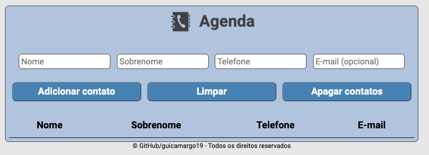

# Agenda de contatos

Projeto desenvolvido no curso de Full Stack Python da EBAC - Escola Britânica de Artes Criativas e Tecnologia.

Agenda de contatos desenvolvida em HTML5 e CSS3 com JavaScript.

Agenda permite a inserção de um contato com nome, sobrenome e um telefone, sendo estes obrigatórios e um e-mail
opcional. Um contato pode ter mais de um telefone e e-mail, mas um telefone e um e-mail não podem ter mais de um
contato vinculado.

A agenda permite limpar os campos através do botão Limpar, e permite também apagar os contatos já registros clicando
no botão Apagar contatos.

### Instalação

Siga estas etapas a seguir para configurar o ambiente de desenvolvimento:

1. Clone este repositório em sua máquina local.
2. Navegue até o diretório clonado e abra no VSCode.
3. Instale a extensão Live Server no VSCode. (https://github.com/ritwickdey/vscode-live-server-plus-plus)
4. Clique em Go Live no canto inferior direito do VSCode para executar o projeto no browser.

## 🛠️ Ferramentas utilizadas para construção do projeto

* **HTML** - Linguagem de marcação utilizada na construção de páginas na Web.
* **CSS** - Cascading Style Sheets é um mecanismo para adicionar estilos a uma página web.
* **JavaScript** - Linguagem de programação interpretada estruturada, de alto nível com tipagem dinâmica fraca e multiparadigma.

## ✒️ Autor

Guilherme Ferreira Camargo
